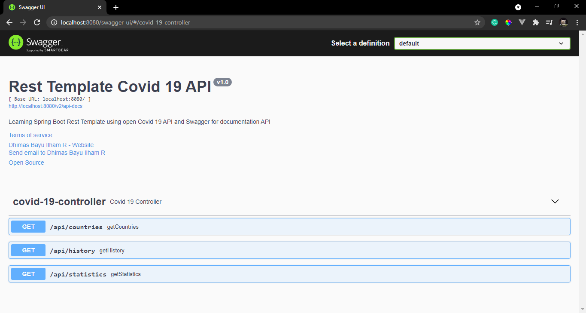

# Rest Template Covid 19 API

Learning Spring Boot Rest Template using open Covid 19 API and Swagger for documentation API

### Screenshot
#### Postman
<b>GET</b> localhost:8080/api/countries 
  
<b>GET</b> localhost:8080/api/statistics 
  
<b>GET</b> localhost:8080/api/history?country=usa&date=2021-05-04 
  
#### Browser
localhost:8080/swagger-ui/#/covid-19-controller
  

### Note
To check out the documentation for the rest template covid 19 API using swagger UI just visit the link down below 
localhost:8080/swagger-ui/  
Don't forget to adding slash after swagger-ui

### Source
[Covid 19 API](https://rapidapi.com/api-sports/api/covid-193)  
[Spring Boot - Rest Template](https://www.tutorialspoint.com/spring_boot/spring_boot_rest_template.htm)